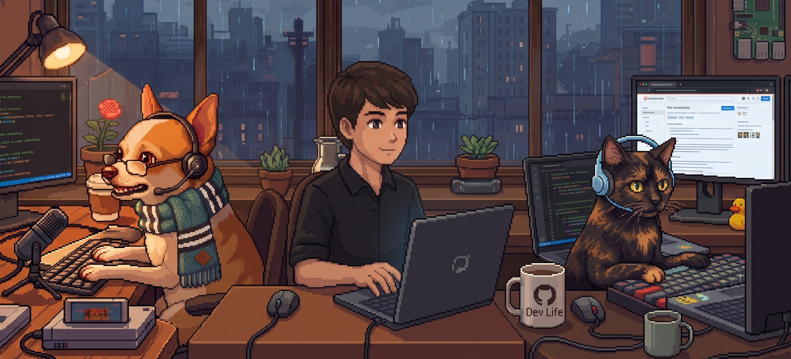

> 🤖 Arte gerada por IA

Atualmente atuo como Desenvolvedor Back-end Júnior desde outubro de 2025, com foco no desenvolvimento e manutenção de aplicações back-end utilizando TypeScript e Node.js. Também sou responsável pela criação de documentações técnicas para apoiar a colaboração entre equipes internas e clientes, além de realizar otimizações, melhorias e correções de bugs nas aplicações.

Iniciei minha jornada na programação em 2021, durante o curso Técnico em Desenvolvimento de Sistemas. Atualmente estou finalizando a graduação em Desenvolvimento de Software Multiplataforma e continuo aprimorando meus conhecimentos em back-end por meio de estudos paralelos, com foco em boas práticas de desenvolvimento, arquitetura de software e construção de APIs.

### Um resumo sobre mim:

```yaml
- 💼 Desenvolvedor Back-end Júnior
- 🎓 Estudante de Desenvolvimento de Software Multiplataforma na Fatec Votorantim
- 🚀 Priorizando meus estudos em Back-end com NestJS, Node.js e MongoDB
- 🌱 Estudando boas práticas e me aprofundando em arquitetura de software
- 🐱🐶 Tenho uma gata e um cachorro

```

---

### Minhas principais tecnologias 

<table>
  <tr>
    <td align="center" width="150">
      <br>
      Node.js
    </td>
    <td align="center" width="150">
      <br>
      TypeScript
    </td>
    <td align="center" width="150">
      <br>
      MongoDB
    </td>
    <td align="center"  width="150">
      <br>
      JavaScript
    </td>
  </tr>

  <tr>
    <td align="center" width="150">
      <br>
      Express
    </td>
    <td align="center" width="150">
      <br>
      NestJS
    </td>
    <td align="center" width="150">
      <br>
      Angular
    </td>
    <td align="center" width="150">
      <br>
      Sequelize
    </td>
  </tr>
</table>

### Também tive contato com

[](https://skillicons.dev)

---


### Meus principais projetos

[](https://github.com/MathGueff/FrontEnd-SaneaSP)
[](https://github.com/MathGueff/BackEnd-SaneaSP)
[](https://github.com/MathGueff/PvZ-Adventures-Fanmade)

> Mais projetos em breve...

---

### Algumas estatísticas:

[](https://github-stats-extended.vercel.app/api?username=MathGueff&rank_icon=github&custom_title=Meus%20Status%20&show_icons=true&include_all_commits=true&theme=rose_pine)

[](https://github-stats-extended.vercel.app/api/top-langs?username=MathGueff&layout=donut&hide_title=true&langs_count=4&theme=radical)

---

### Como entrar em contato comigo:
[](https://www.linkedin.com/in/matheus-gueff-b74949311/)
[](mailto:gueffmatheus@gmail.com)
